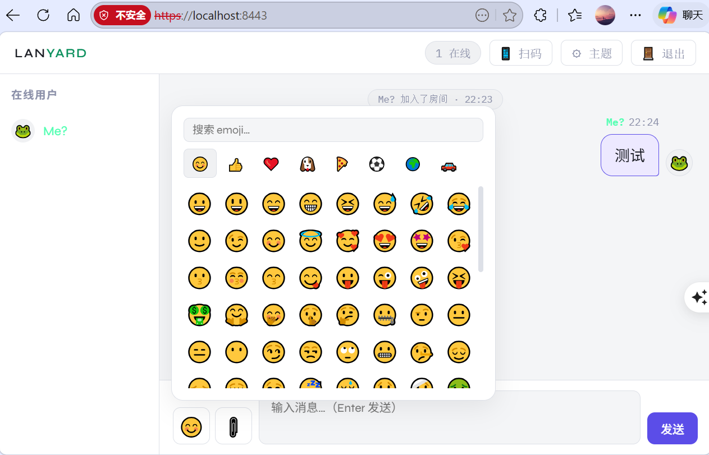

# LanYard 🔒

**在局域网里安全分享文件、消息和图片的工具**

​        这个程序的最初目的是：偶尔需要在两台电脑之间传送一些文件、消息或者截图，因不太喜欢用电脑版微信，也不想另外装其它软件。

​        这个工具还支持多人共享，只要局域网内IP能互通，一个人运行下这个python文件，其他人可以通过电脑浏览器打个IP地址加端口号或者手机直接扫码交流、传送信息、工作文件及截图。

|  |  |
| ---------------------------------------------------- | ------------------------------------ |

---

## 特性

### 🔐 安全与加密
- **消息端到端加密** — AES-256-GCM，消息在浏览器加密后才发出，服务器只转发密文，无法读取内容
- **文件端到端加密** — 文件和文件名均在客户端加密后上传，服务器存储的全是密文
- **传输层加密** — HTTPS + WSS（自签 TLS 证书），防止局域网抓包
- **房间密码保护** — 可设置进房密码，WebSocket 连接与文件上传均需验证，密码以 SHA-256 哈希存储

### 💬 聊天与协作
- **多用户实时聊天** — WebSocket，低延迟实时通信
- **头像选择** — 30 款 emoji 头像，消息气泡和用户列表均显示头像
- **自定义昵称与颜色** — 区分不同用户身份
- **在线用户列表** — 实时显示当前房间成员
- **消息历史** — 新成员加入可查看最近 50 条记录

### 📁 文件传输
- **拖拽发送文件** — 直接把文件拖进浏览器窗口即可发送
- **剪贴板粘贴图片** — Ctrl+V 直接发送截图，自动命名加时间戳
- **图片自动预览** — 收到图片文件后自动在线解密预览，点击可下载
- **上传/下载进度条** — 实时显示传输进度百分比
- **流式分块写入** — 服务端按 1MB 分块处理，避免大文件撑爆内存

### 🎨 界面与体验
- **6 套主题** — 暗黑 / 明亮 / 深蓝 / 樱花 / 森林 / 琥珀，主题选择自动记忆
- **Emoji 选择器** — 8 大分类、数百个 emoji，支持搜索，点击插入光标位置
- **扫码加入** — 生成二维码，手机扫一扫即可连接
- **刷新不掉线** — 登录状态存入 sessionStorage，刷新页面自动恢复会话
- **单 IP 防重复** — 同一设备重新连接时自动顶掉旧连接，2 秒防抖避免刷新误报离线

---

## 安装依赖

```bash
pip install fastapi "uvicorn[standard]" python-multipart qrcode pillow cryptography
```

> Python 3.10+ 推荐。`tkinter` 为 Python 标准库自带，无需额外安装。

---

## 启动方式

### 方式一：图形界面启动器（推荐）

```bash
python launcher.py
```

弹出一个小窗口，填写房间名称、端口、密码、最大文件大小，点击「🚀 启动服务器」即可。服务器启动后启动器自动关闭。

> ⚠️ launcher.py 使用 `tkinter`，在部分 Linux 发行版上需要额外安装：
> `sudo apt install python3-tk`

### 方式二：命令行直接启动

```bash
# 最简启动（使用所有默认值）
python server.py

# 自定义房间名和端口
python server.py --name "团队空间" --port 9443

# 启用房间密码
python server.py --name "私密房间" --password mySecret123

# 完整参数示例
python server.py --name "研发组" --port 8443 --password abc123 --max-file 1000
```

### 启动参数说明

| 参数 | 默认值 | 说明 |
|------|--------|------|
| `--name` | `LANYARD` | 房间名称，显示在页面左上角 |
| `--port` | `8443` | 监听端口号 |
| `--password` | 空（不加密） | 房间密码，留空则所有人可自由进入 |
| `--max-file` | `500` | 单次文件上传的最大体积（MB） |

---

## 访问地址

启动后终端会打印访问地址，例如：

```
══════════════════════════════════════════════════════
  🔒 LANYARD  局域网加密通信
══════════════════════════════════════════════════════
  本机地址 → https://192.168.1.100:8443
  本地访问 → https://localhost:8443
  房间密码 → 未设置
══════════════════════════════════════════════════════
```

- 在**本机**访问：`https://localhost:8443`
- 同一**局域网**内其他设备：`https://<显示的本机IP>:8443`
- 或点击页面右上角「📱 扫码」，手机扫码直接跳转

> ⚠️ **证书警告**：首次访问浏览器会提示"您的连接不是私密连接"，这是因为使用了自签 TLS 证书。
> 点击「高级」→「继续前往（不安全）」即可，不影响实际加密效果。

---

## 加密原理

```
客户端 A                          服务器                         客户端 B
────────────────────────────────────────────────────────────────────────
[首次访问] ── GET /api/key 或 POST /api/auth ──► 返回 AES-256 密钥
             ◄──────────────────────────────────

[发送消息]
明文 ──► 随机 nonce + AES-GCM 加密 ──► 密文 ──► WSS 转发 ──► AES-GCM 解密 ──► 明文

[发送文件]
文件 ──► 随机 nonce + AES-GCM 加密 ──► 密文 ──► HTTPS 上传 ──► 服务器存储密文
文件名 ──► 单独加密存储

[其他设备下载]
密文 ──► HTTPS 下载 ──► AES-GCM 解密 ──► 原始文件
```

**每条消息、每个文件都使用独立的随机 nonce（12 字节）**，保证密文不可重放攻击。

---

## 安全说明

| 威胁场景 | 应对措施 |
|----------|----------|
| 局域网抓包 | TLS（HTTPS/WSS）加密所有传输内容 |
| 服务器查看消息或文件 | 端到端 AES-256-GCM，服务端只接触密文 |
| 重放攻击 | 每次加密使用独立随机 nonce |
| 路径穿越攻击 | 文件 ID 强制 UUID 格式校验 |
| 未授权进房 | 房间密码以 SHA-256 哈希校验，WebSocket 和文件上传均需携带 token |
| 同 IP 多开 | 新连接自动踢掉旧连接，防止僵尸会话 |

> **已知局限**：AES 密钥通过 `/api/key`（或 `/api/auth`）下发，同一房间内所有用户共享同一密钥——服务器持有密钥，理论上可以解密内容。若需严格的"服务器也无法解密"，可改用 ECDH 密钥交换实现真正的点对点加密。

---

## 文件结构

```
lanyard/
├── launcher.py      # 图形界面启动器（tkinter）
├── server.py        # 后端服务（FastAPI + uvicorn）
├── static/
│   └── index.html   # 前端单页应用（纯原生 JS）
├── certs/           # 自动生成的自签 TLS 证书
│   ├── cert.pem
│   └── key.pem
├── uploads/         # 加密文件临时存储（可定期清理）
└── README.md
```

> `uploads/` 目录中存储的均为 AES-256-GCM 密文，即使直接访问服务器文件系统也无法读取原始内容。可设置定时任务定期清理该目录。
